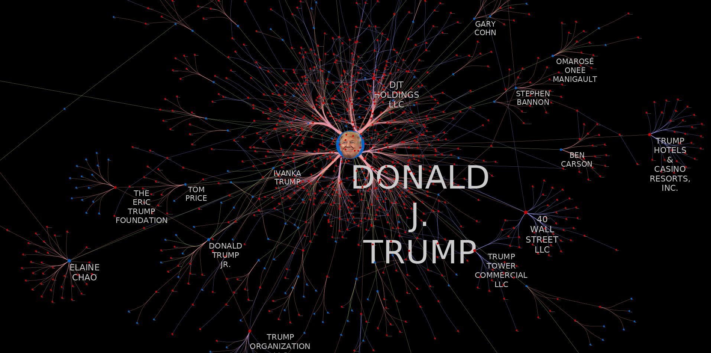
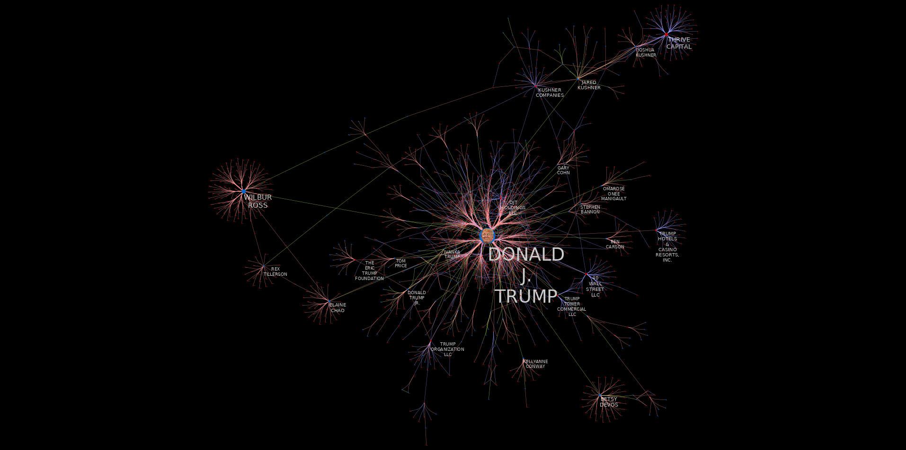
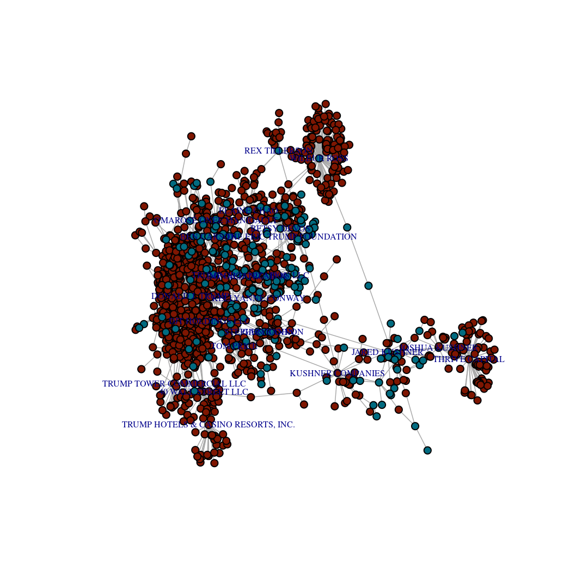

Overview
========

This [RMarkdown](http://rmarkdown.rstudio.com/) document provides some
simple R code for parsing the [BuzzFeed TrumpWorld open
dataset](https://www.buzzfeed.com/johntemplon/help-us-map-trumpworld?utm_term=.prXl6l32Z#.id0L5LXdZ),
and generating both an internal [igraph](http://igraph.org/r/)
representation of the dataset, as well as an exported
[GraphML](http://graphml.graphdrawing.org/) network file, allowing for
the easy import into external tools such as
[Cytoscape](http://www.cytoscape.org/).

Below are a couple example visualizations created by assigning various
visual properties (vertex size and color, edge color, etc.) to different
data variables, as well as computed network metrics.

    library('igraph')

    ## 
    ## Attaching package: 'igraph'

    ## The following objects are masked from 'package:stats':
    ## 
    ##     decompose, spectrum

    ## The following object is masked from 'package:base':
    ## 
    ##     union

    library('knitr')

    # knitr options
    opts_chunk$set(fig.width=1080/192,
                   fig.height=1080/192,
                   dpi=192)

    # igraph options
    igraph.options(vertex.size=4,
                   vertex.label.cex=0.5,
                   edge.arrow.mode='-',
                   edge.width=0.75)

    # behave, R
    options(stringsAsFactors=FALSE)

    # load data
    base_url <- "https://docs.google.com/spreadsheets/d/1Z5Vo5pbvxKJ5XpfALZXvCzW26Cl4we3OaN73K9Ae5Ss/pub?gid=%d&output=csv"

    # google drive sheet identifiers
    sheets <- list('org-org'=634968401, 'person-org'=1368567920,
                   'person-person'=905294723)

    # vectors to keep track of vertex types
    orgs <- c()
    people <- c()

    # combine into a single dataframe, keeping track of edge and vertex types
    dat <- data.frame()

    for (sheet_name in names(sheets)) {
        url <- sprintf(base_url, sheets[[sheet_name]])
        sheet <- read.csv(url)
        colnames(sheet) <- c('a', 'b', 'connection', 'source')

        # vertex type
        if (sheet_name == 'org-org') {
            orgs <- unique(append(orgs, sheet$a))
            orgs <- unique(append(orgs, sheet$b))
        } else if (sheet_name == 'person-org') {
            orgs <- unique(append(orgs, sheet$a))
            people <- unique(c(people, sheet$b))
        } else {
            people <- unique(c(people, sheet$a))
            people <- unique(c(people, sheet$b))
        }

        # append to combined data frame
        dat <- rbind(dat, cbind(sheet, 'edge_type'=sheet_name))
    }

    # create a graph instance
    g <- graph_from_data_frame(dat)

    # assign vertex types
    V(g)$type <- ifelse(V(g)$name %in% people, 'person', 'organization')

    # only label vertices with more than 10 edges connecting to them
    V(g)$label <- ifelse(degree(g) > 10, V(g)$name, NA)

    # color vertices based on type (person/organization)
    vertex_colors <- ifelse(V(g)$type == 'person', '#016b80', '#7f1601')

    coords = layout.fruchterman.reingold(g)
    plot(g, vertex.label=V(g)$label, vertex.color=vertex_colors,
         layout=coords)

    # save as GraphML
    write_graph(g, file=file.path('data', 'trump_world.graphml'), format='graphml')
