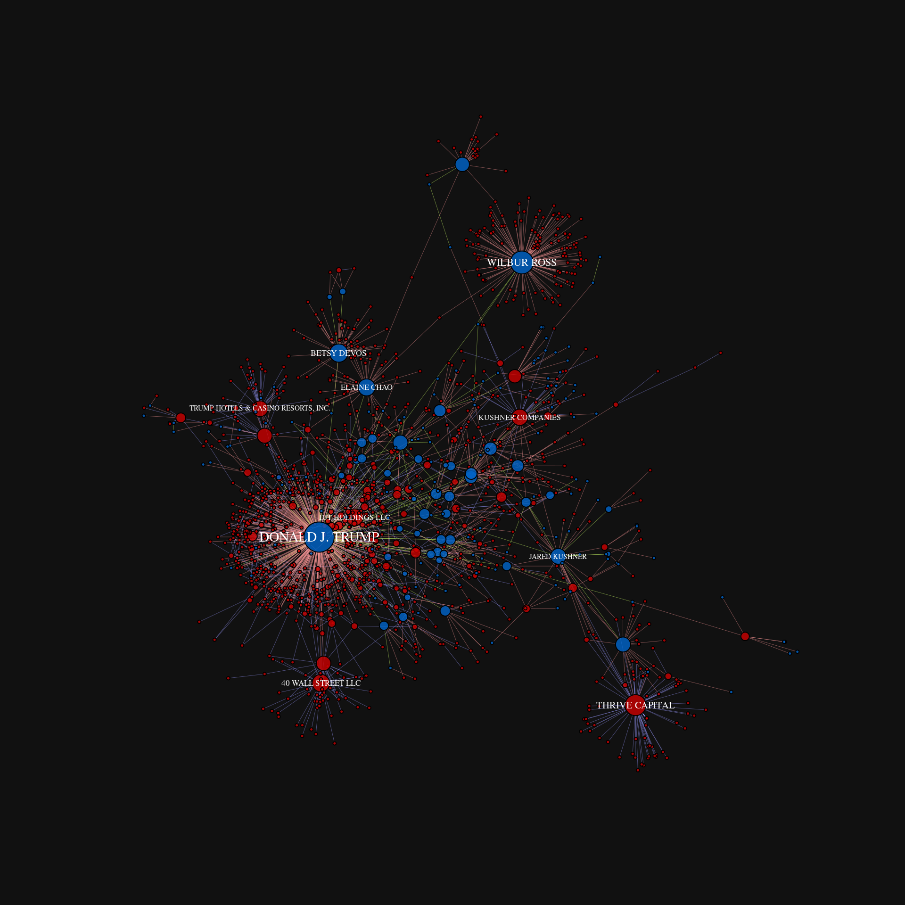

Overview
========

This [RMarkdown](http://rmarkdown.rstudio.com/) document provides some simple R code for parsing the [BuzzFeed TrumpWorld open dataset](https://www.buzzfeed.com/johntemplon/help-us-map-trumpworld?utm_term=.prXl6l32Z#.id0L5LXdZ), and generating both an internal [igraph](http://igraph.org/r/) representation of the dataset, as well as an exported [GraphML](http://graphml.graphdrawing.org/) network file, allowing for the easy import into external tools such as [Cytoscape](http://www.cytoscape.org/).

Below are a couple example visualizations created by assigning various visual properties (vertex size and color, edge color, etc.) to different data variables, as well as computed network metrics.


Methods
=======

Setup
-----

``` r
library('igraph')
library('knitr')

# knitr options
opts_chunk$set(fig.width=1920/192,
               fig.height=1920/192,
               dpi=192)

# igraph options
igraph.options(vertex.label.color='white', 
               edge.arrow.mode='-',
               edge.width=0.4)

# behave, R
options(stringsAsFactors=FALSE)
```

Load data
---------

Next, in order to create a single data sheet from the three separate Google doc sheets (person-person, organization-organization, and person-organization), we will download each of the sheets, and combine them into a single dataframe, keeping track of both the node and edge types.

``` r
# load data
base_url <- "https://docs.google.com/spreadsheets/d/1Z5Vo5pbvxKJ5XpfALZXvCzW26Cl4we3OaN73K9Ae5Ss/pub?gid=%d&output=csv"

# google drive sheet identifiers
sheets <- list('org-org'=634968401, 'person-org'=1368567920,
               'person-person'=905294723)

# vectors to keep track of vertex types
orgs <- c()
people <- c()

# combine into a single dataframe, keeping track of edge and vertex types
dat <- data.frame()

for (sheet_name in names(sheets)) {
    url <- sprintf(base_url, sheets[[sheet_name]])
    sheet <- read.csv(url)
    colnames(sheet) <- c('a', 'b', 'connection', 'source')

    # vertex type
    if (sheet_name == 'org-org') {
        orgs <- unique(append(orgs, sheet$a))
        orgs <- unique(append(orgs, sheet$b))
    } else if (sheet_name == 'person-org') {
        orgs <- unique(append(orgs, sheet$a))
        people <- unique(c(people, sheet$b))
    } else {
        people <- unique(c(people, sheet$a))
        people <- unique(c(people, sheet$b))
    }

    # append to combined data frame
    dat <- rbind(dat, cbind(sheet, 'edge_type'=sheet_name))
}
```

Network construction
--------------------

Now that we have a single dataframe describing each edge in the dataset, along with some additional metadata, we will create an igraph graph instance of the data frame.

``` r
# create a graph instance
g <- graph_from_data_frame(dat)

# assign vertex types
V(g)$type <- ifelse(V(g)$name %in% people, 'person', 'organization')

# only label vertices with more than 25 edges connecting to them
V(g)$label <- ifelse(degree(g) > 25, V(g)$name, NA)

# scale vertex size based on node degree
vertex_size <- pmax(1, log2(degree(g)))

# color vertices based on type (person/organization)
vertex_colors <- ifelse(V(g)$type == 'person', '#0066CCCC', '#CC0000CC')

# vertex label properties
vertex_label_cex <- vertex_size / 10

# color edges based on connection type
edge_color <- ifelse(E(g)$edge_type == 'org-org', '#9999FF88',
                     ifelse(E(g)$edge_type == 'person-person', '#CCFF6688',
                            '#FF999988'))

# assign edge weight based on edge-betweeness
E(g)$weight <- edge.betweenness(g)

# visualize the network using igraph
coords <- layout.fruchterman.reingold(g, weights=E(g)$weight)

par(bg="#111111")
plot(g, 
     vertex.label=V(g)$label, 
     vertex.color=vertex_colors,
     vertex.size=vertex_size, 
     vertex.label.cex=vertex_label_cex,
     edge.color=edge_color,
     layout=coords)
```



Save network
------------

Finally, let's save the network as a GraphML file. This will allow us to provide a single file including both the network topology and and node/edge metadata.

    write_graph(g, file=file.path('data', 'trump_world.graphml'), format='graphml')

All done!

System information
==================

``` r
sessionInfo()
```

    ## R version 3.3.2 (2016-10-31)
    ## Platform: x86_64-pc-linux-gnu (64-bit)
    ## Running under: Arch Linux
    ## 
    ## locale:
    ##  [1] LC_CTYPE=en_US.UTF-8       LC_NUMERIC=C              
    ##  [3] LC_TIME=en_US.UTF-8        LC_COLLATE=en_US.UTF-8    
    ##  [5] LC_MONETARY=en_US.UTF-8    LC_MESSAGES=en_US.UTF-8   
    ##  [7] LC_PAPER=en_US.UTF-8       LC_NAME=C                 
    ##  [9] LC_ADDRESS=C               LC_TELEPHONE=C            
    ## [11] LC_MEASUREMENT=en_US.UTF-8 LC_IDENTIFICATION=C       
    ## 
    ## attached base packages:
    ## [1] stats     graphics  grDevices utils     datasets  methods   base     
    ## 
    ## other attached packages:
    ## [1] knitr_1.15.1   igraph_1.0.1   rmarkdown_1.3  nvimcom_0.9-25
    ## [5] colorout_1.1-1
    ## 
    ## loaded via a namespace (and not attached):
    ##  [1] backports_1.0.4 magrittr_1.5    rprojroot_1.1   htmltools_0.3.5
    ##  [5] tools_3.3.2     yaml_2.1.14     Rcpp_0.12.8     stringi_1.1.2  
    ##  [9] highr_0.6       stringr_1.1.0   digest_0.6.11   evaluate_0.10
